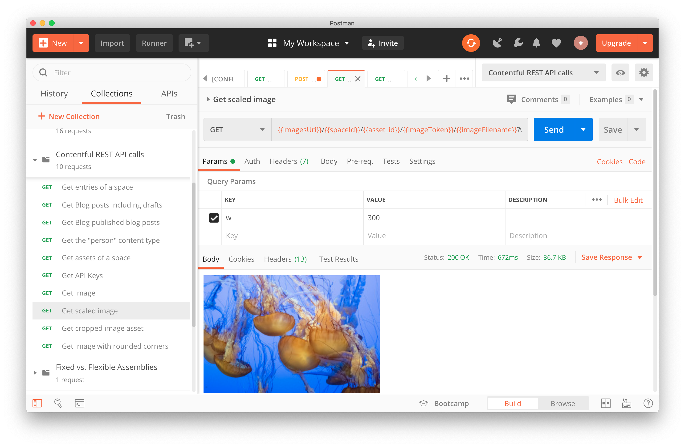

# Contentful REST API Postman Tutorial
This repo contains two Postman export files. Import both the API collection as well as the environment settings into Postman, choose the environment you just uploaded, and start making Contentful REST API calls!

We have example API calls for the Content Delivery API, Preview API and Images API. Since the Content Management API writes data we will provide a set of tutorial API calls in a future release that will reference content in a space that you own.

You can watch this [video](https://contentful.wistia.com/medias/lvmofw41fi) to see a quick demo of the API calls.

